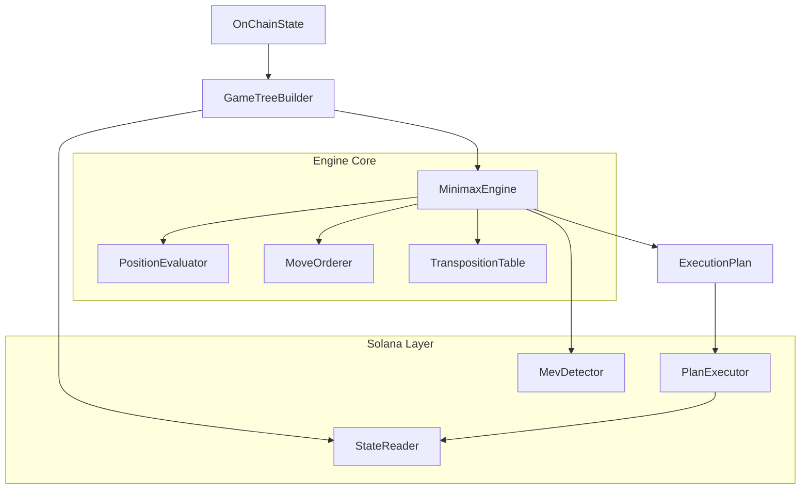

# MNMX Core

[](https://github.com/mnmx-protocol/mnmx-core/actions)
[](./LICENSE)
[](https://www.typescriptlang.org/)
[](https://solana.com/)
[](https://www.npmjs.com/package/@mnmx/core)

---

**Minimax execution engine for autonomous on-chain agents.**

MNMX applies adversarial game-tree search to on-chain execution. The core insight is that DeFi transactions operate in an adversarial environment -- MEV bots watch the mempool and act against you. This is structurally identical to a two-player zero-sum game: your agent is the maximizer, MEV bots are the minimizers.

The same minimax algorithm that powers chess engines can determine the optimal sequence of on-chain actions when the opponent is a rational, profit-seeking adversary. MNMX implements this with alpha-beta pruning, iterative deepening, transposition tables, and move ordering heuristics -- the same toolkit that took game engines from brute force to superhuman play.

The result: execution plans that are provably optimal against rational adversaries, not just heuristically "good enough."

## Architecture



**Data flow:**

1. **StateReader** fetches token balances, pool reserves, and pending transactions from Solana RPC.
2. **GameTreeBuilder** constructs the game tree by simulating agent actions and adversary responses.
3. **MinimaxEngine** searches the tree with alpha-beta pruning, using iterative deepening to search depth 1, 2, 3, ... until the time budget expires.
4. **PositionEvaluator** scores leaf nodes across four dimensions: gas cost, slippage impact, MEV exposure, and profit potential.
5. **MevDetector** identifies sandwich, frontrun, backrun, and JIT liquidity threats.
6. **PlanExecutor** converts the optimal action sequence into Solana transactions and submits them.

## Quick Start

```bash
git clone https://github.com/mnmx-protocol/mnmx-core.git
cd mnmx-core
npm ci
npm run build
npm test
```

## Usage

```typescript
import { MinimaxEngine } from '@mnmx/core';
import type { OnChainState, ExecutionAction } from '@mnmx/core';

const engine = new MinimaxEngine({
  maxDepth: 5,
  alphaBetaPruning: true,
  timeLimitMs: 3_000,
  evaluationWeights: {
    gasCost: 0.10,
    slippageImpact: 0.30,
    mevExposure: 0.35,
    profitPotential: 0.25,
  },
  maxTranspositionEntries: 100_000,
});

// Fetch current on-chain state
const state: OnChainState = await stateReader.getOnChainState(wallet, pools);

// Define candidate actions
const actions: ExecutionAction[] = [
  {
    kind: 'swap',
    tokenMintIn: 'So11111111111111111111111111111111111111112',
    tokenMintOut: 'EPjFWdd5AufqSSqeM2qN1xzybapC8G4wEGGkZwyTDt1v',
    amount: 1_000_000_000n,
    slippageBps: 50,
    pool: 'pool_address_here',
    priority: 1,
    label: 'SOL -> USDC swap',
  },
];

// Search for the optimal execution plan
const plan = engine.search(state, actions);

console.log(`Best action: ${plan.actions[0].label}`);
console.log(`Score: ${plan.totalScore}`);
console.log(`Nodes explored: ${plan.stats.nodesExplored}`);
console.log(`Nodes pruned: ${plan.stats.nodesPruned}`);
console.log(`Depth reached: ${plan.stats.maxDepthReached}`);
```

## How the Minimax Engine Works

The engine models on-chain execution as a two-player game:

```
Game Tree (depth 4):

                        [Current State]                    depth 0
                       /       |        \                  AGENT
                    Swap-A   Swap-B   Swap-C
                   /    \      |       /   \
              [s1a]    [s1b] [s2]   [s3a] [s3b]           depth 1
              Sand.  Nothing Front.  JIT  Nothing          ADVERSARY
              /  \      |     |      |      |
           [s2a][s2b] [s2c] [s2d]  [s2e] [s2f]            depth 2
           Sw-A Sw-B  Sw-A  Sw-B   Sw-A  Sw-C             AGENT
            |    |      |     |      |      |
           ...  ...    ...   ...    ...    ...              depth 3
                                                           ADVERSARY
```

1. **Agent nodes (MAX)**: Choose the action that maximizes score.
2. **Adversary nodes (MIN)**: MEV bots choose the response that minimizes our score.
3. **Alpha-beta pruning**: Skip branches that cannot improve the outcome.
4. **Iterative deepening**: Search depth 1, 2, 3, ... until time runs out.
5. **Transposition table**: Cache evaluated positions to avoid re-computation.
6. **Move ordering**: Try promising actions first for better pruning.

### Evaluation Function

Each leaf position is scored across four dimensions:

| Dimension        | Weight | Description                                      |
|------------------|--------|--------------------------------------------------|
| Gas Cost         | 0.10   | Estimated compute units and priority fee          |
| Slippage Impact  | 0.30   | Market impact relative to pool depth              |
| MEV Exposure     | 0.35   | Probability-weighted cost of adversarial attacks  |
| Profit Potential | 0.25   | Net expected value after all costs                |

## API Reference

### MinimaxEngine

The core search engine. Implements negamax with alpha-beta pruning and iterative deepening.

| Method | Signature | Description |
|--------|-----------|-------------|
| `constructor` | `(config?: Partial<SearchConfig>)` | Create engine with optional config overrides |
| `search` | `(state: OnChainState, actions: ExecutionAction[]) => ExecutionPlan` | Run minimax search and return the optimal plan |
| `reset` | `() => void` | Clear transposition table and move ordering data |

### GameTreeBuilder

Constructs and simulates the adversarial game tree.

| Method | Signature | Description |
|--------|-----------|-------------|
| `buildTree` | `(state, actions, threats) => GameNode` | Construct full game tree |
| `simulateAction` | `(state, action) => OnChainState` | Simulate an action on state |
| `generateAdversaryMoves` | `(state, action) => MevThreat[]` | Generate probable MEV responses |

### PositionEvaluator

Scores (state, action) pairs using the weighted evaluation function.

| Method | Signature | Description |
|--------|-----------|-------------|
| `evaluate` | `(state: OnChainState, action: ExecutionAction) => EvaluationResult` | Score a position |

### MevDetector

Identifies MEV threats from pending transactions and pool state.

| Method | Signature | Description |
|--------|-----------|-------------|
| `detectThreats` | `(action, recentTxs) => MevThreat[]` | Identify all MEV threats |
| `analyzeSandwichRisk` | `(action, txs) => MevThreat \| null` | Sandwich attack analysis |
| `analyzeJitRisk` | `(action, pool) => MevThreat \| null` | JIT liquidity analysis |

### PlanExecutor

Converts execution plans into Solana transactions.

| Method | Signature | Description |
|--------|-----------|-------------|
| `execute` | `(plan: ExecutionPlan) => Promise<ExecutionResult>` | Submit plan as transactions |
| `buildTransaction` | `(action) => Transaction` | Build a single transaction |
| `simulateTransaction` | `(tx) => Promise<SimulationResult>` | Simulate without submitting |

### StateReader

Fetches aggregated on-chain state from Solana RPC.

| Method | Signature | Description |
|--------|-----------|-------------|
| `getOnChainState` | `(wallet, pools) => Promise<OnChainState>` | Fetch aggregated state |
| `getTokenBalances` | `(wallet) => Promise<Map<string, bigint>>` | Fetch SPL token balances |
| `getPoolState` | `(pool) => Promise<PoolState>` | Fetch pool reserves and config |

## Running Tests

```bash
npm test
```

## Building

```bash
npm run build
```

## References

- Von Neumann, J. (1928). "Zur Theorie der Gesellschaftsspiele." *Mathematische Annalen*, 100(1), 295-320.
- Shannon, C. E. (1950). "Programming a Computer for Playing Chess." *Philosophical Magazine*, 41(314).
- Knuth, D. E. & Moore, R. W. (1975). "An Analysis of Alpha-Beta Pruning." *Artificial Intelligence*, 6(4), 293-326.

## Links

- Website: https://mnmx.io
- X: https://x.com/mnmx_protocol

## License

[MIT](./LICENSE) -- Copyright (c) 2026 MNMX Protocol
